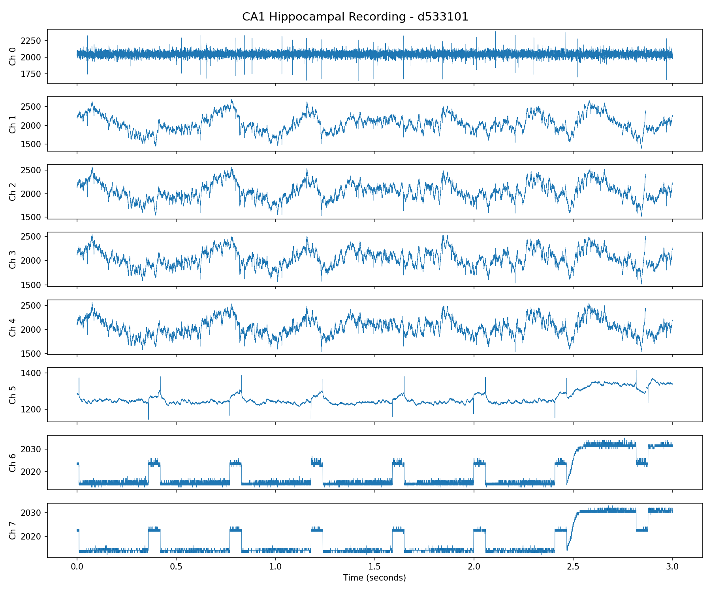
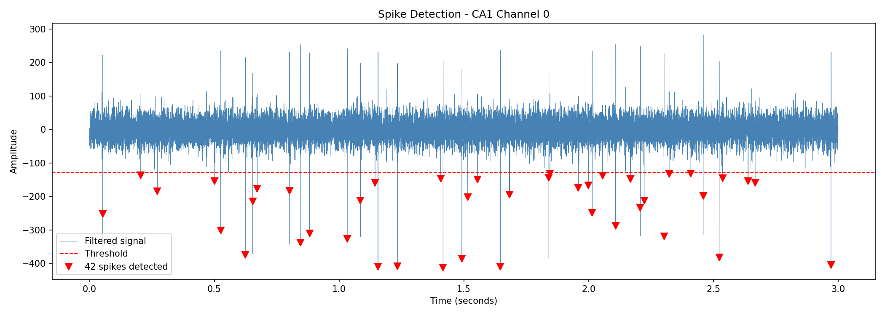
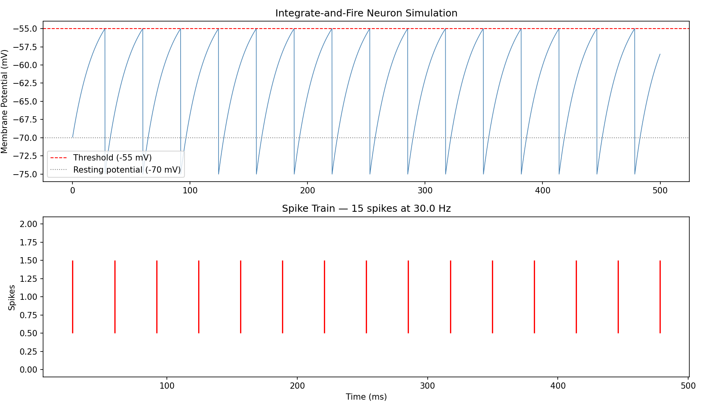

# Action Potential Analysis
### A self-guided computational neuroscience project

This project was built using publicly available 
data and open source tools.

---

## What this project does

**1. Neural Data Analysis**
Downloads and visualizes real extracellular and intracellular recordings from rat 
hippocampal area CA1, sourced from the Buzsaki Lab via CRCNS.org.

**2. Spike Detection**
Applies a highpass filter and threshold-based algorithm to detect individual action 
potentials from raw electrode recordings. Detected 42 spikes in 3 seconds of CA1 data.

**3. Integrate-and-Fire Neuron Simulation**
Builds a leaky integrate-and-fire model from mathematical first principles, simulating 
a neuron that fires at 30 Hz under constant input current.

---

## Data Source
Henze et al., J. Neurophysiology 84, 390-400 (2000)
Simultaneous intracellular and extracellular recordings from hippocampus region CA1 
of anesthetized rats. Contributed by Gyorgy Buzsáki lab, NYU. Via CRCNS.org.

---

## Tools used
- Python 3.13
- NumPy, SciPy, Matplotlib
- VS Code

---

## Results

### Raw CA1 Hippocampal Recording

### Spike Detection — 42 spikes detected in 3 seconds

### Integrate-and-Fire Neuron Simulation — 30 Hz firing rate

---

*This project is documented as part of Black Box Lab. Read the full article at [Black Box Lab on Substack].*
